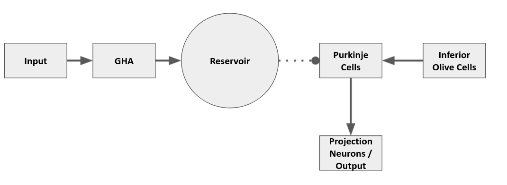
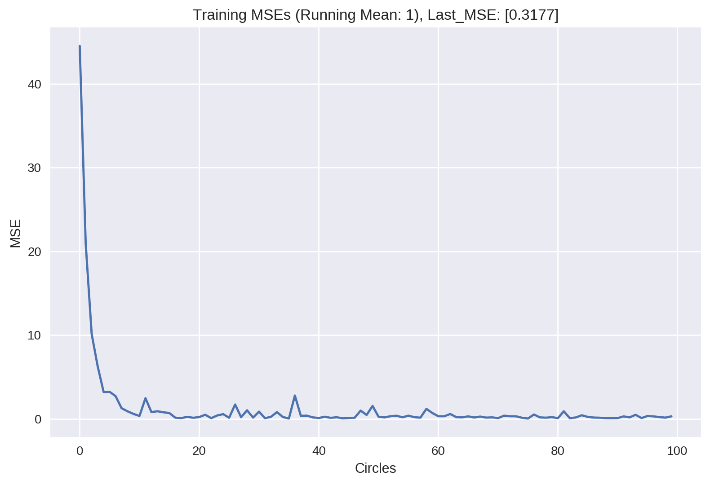
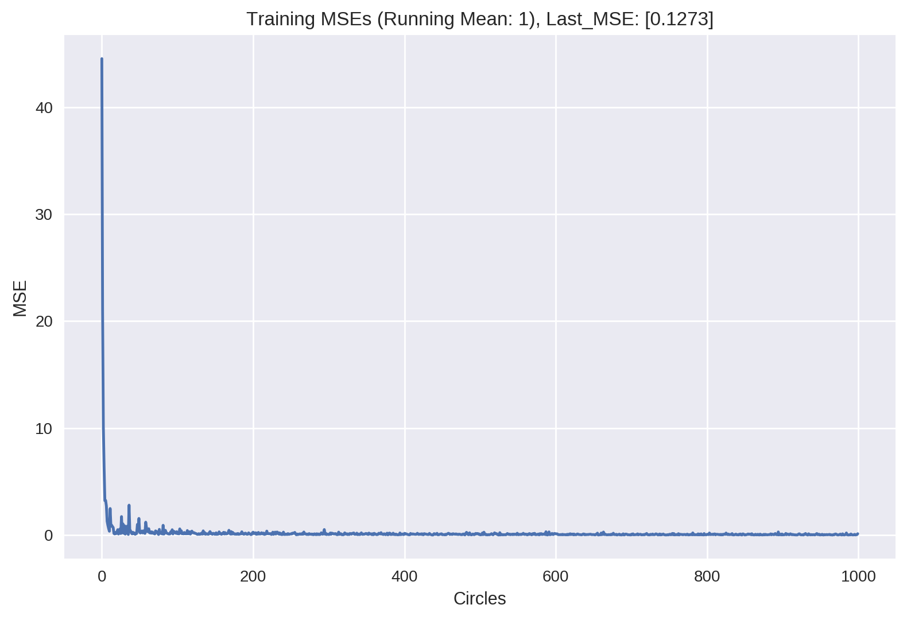
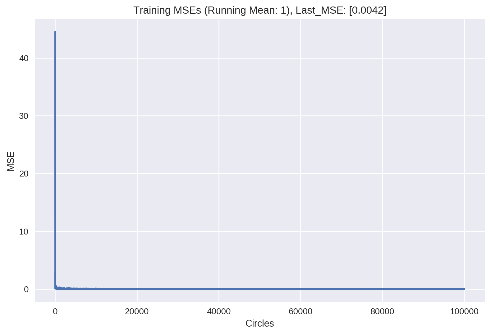
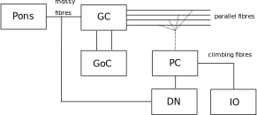

# Model

The current network is a reservoir computing model structurally inspired by the human cerebellum. Input (mossy fibers) is fed through a intermediary layer into a reservoir and the output cells (projection neurons). A general hebbian algorithm layer is used as the intermediary to decorrelate the input information before it is redirected to the reservoir. The reservoir is read out by a feedforward layer the purkinje cells which in turn inhibit the projection neurons (dentate nucleus neurons). The projection neurons fire rate functions as the model output on which basis the error is calculated. Based on the error feedback from the inferior olive cells synaptic weights are adjusted between the reservoir and the purkinje cell layer. The layers of the purkinje cells, inferior olive cells and the projection neurons consist of each one neuron for the x and y coordinate.  
\
\
\

{width=80%}

\
\
\
The model is trained to predict the next position of the hand of a 2d arm (($x_{t+1}$, $y_{t+1}$)) based on the current position (($x_{t}$, $y_{t}$)) and a movement command in form of the $\Delta$ of the joint angles ($\Delta\Theta_{elbow}$ and $\Delta\Theta_{shoulder}$ ). The base of the arm is situated at the coordinate origin. Additionally the input contains the information about the $\Delta$ of the last step to the current step i.e.  ($\Delta x = x_{t} - x_{t-1}$; $\Delta y = y_{t} - y_{t-1}$). 

Furthermore the input was based on the target circle and not on the predictions of the model i.e. the current position of the hand at timestep $t+1$ is represented by the target of timestep $t$ and not of the model prediciton of timestep $t$. Thus $\Delta\Theta_{elbow}$ and $\Delta\Theta_{shoulder}$ was calculated as the movement command from the last position on the target circle to the current position on the target circle. The same principle applies to the information about the last step i.e. $\Delta x = x_t - x_{t-1} = x_{target_t-1}-x_{t-1}$. Keep in mind that $x_t = x_{target_t-1}$. 

The error was calculated as normalized MSE based on the difference of the predicted ($x_{t+1}$, $y_{t+1}$) and ($x_{target}$, $y_{target}$). 

Training was done with 100.000 Circles, with 8 predictions/steps each. Each circle differentiated in the center of the circle, the radius, and the starting position of the hand in the circle. The degrees determining the movement per timestep was constant at 43 degrees each step. Thus each circle needed 8 steps for one complete circumnavigation. 

# Equations:

Learning only happened in the synapses between the reservoir and the purkinje cell layer. Weights are adjusted with a modified delta learning algorithm:

$$
\begin{aligned}\Delta_{ij} =  \eta * (r_{i} * error_{j} - c*w_{ij)}) \\\end{aligned}
$$

The learning rate was set to $\eta = 0.005$ . A cost parameter was added and set to $c = 0.001$. 

Fire rate of the the purkinje cell layer is not dynamic and described by
$$
\begin{aligned}r_{j} = \sum^i w_{ij}* r_i \\\end{aligned}
$$

Reservoir Neurons follow first-order ODEs:
$$
\tau + \frac {dx(t)}{dt} + x(t)= \sum w^{in} * r^{in}(t)+g
$$

with $\tau = 10$ and $g = 1$ .

Fire rate of the reservoir neurons was defined as :
$$
r(t) = tanh(x(t))
$$

## Task 

In the random dot task, the movement of the dot displayed on the monitor consisted of the movement of the test subject and added noise. The ratio was specified by the control level, which defined the percentage of control a test subject had ofter the movement of the dot. To simulate a similar task for the model a visual display circle was calculated. It was based on the a target circle with added noise. The noise added was take from the same noise array as in the dot task. An array with prerecoreded pseudorandom movements. Each step a random movement of the array was taken, normalized and added to the movement of the target circle. The control level specified the percentage of the movement done by noise or true movement.  

This visual display was fed as input into the model. i.e.:

* the current position of the effector (($x_{t}$, $y_{t})_{vd}$) was taken from the visual display and not from the target circle or the prediction of them model of the previous step.
*  $\Delta\Theta_{elbow}$ and $\Delta\Theta_{shoulder}$ were calculated for the movement from ($x_{t}$, $y_{t})_{vd}$ to the target on the target circle for current step
* $\Delta x$ and $\Delta y$ were based on the last movement by the visual display ($\Delta x = (x_t - x_{t-1})_{vd}$ ; $\Delta y = (y_t - y_{t-1})_{vd}$ )

The error for each circle was calculated as mean square error.  

Testing was conducted 1000 times. Starting with control level 0 and incrementing it by +0.001 each testing run. Each test consistet of 20 circles. Circles where build as in training, differentiating in radius, circle center and starting position on the circle. 
\
\
\ 

## Results 

### Training
As can be seen in figures 2 to 4 MSE decreases rapidly during training. 

{width=40%}

{width=40%}

{width=40%}

Video 1 illustrates how the model performance progresses through training. 

<iframe src='./videos/training/training_circles_0-99999.mp4.mp4' frameborder='0' allowfullscreen></iframe>

### Test

$$
\begin{aligned}
p_i(t) = \Bigg[\sum_j^{N_z} & D_{ij}\, m_{ij}\, \sum_{s=1}^t \exp\bigg({-\frac{t-s}{\tau_m}}\bigg)\, z_j(s-1) \\
+ & \sum_j^{N_i} H_{ij}\, w_{IO}\, \sum_{s=1}^t \exp\bigg({-\frac{t-s}{\tau_\text{IO}}}\bigg) \, l_j(s-1)\Bigg]^+ \\
\end{aligned}
$$

## Figures:

Videos from Youtube:

<iframe src='https://www.youtube.com/embed/qhUvQiKec2U' frameborder='0' allowfullscreen></iframe>

Local videos:

<iframe src='./videos/cover.mp4' frameborder='0' allowfullscreen></iframe>

## Tasks

## Results
 Videos

<iframe src='./videos/training_circle_20-99999.mp4' frameborder='0' allowfullscreen></iframe>

{width=80%}