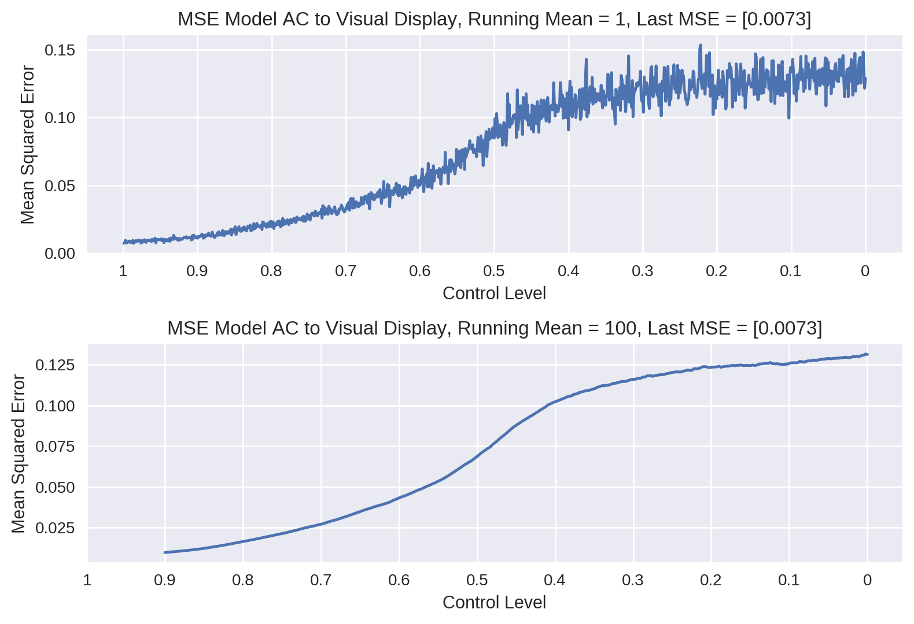

Movements require precise timing and an accurate representation of the body's state in the environment. Yet sensory feedback is subject to variable degrees of delay. With delayed information about the state of the body, movement control would occur based on a past state and not the current state, resulting in false corrections such as overshooting the target. It is believed that movement control is based on internal models predicting the future state of the body. The two internal models of motor control are the **inverse model**, which issues a motor command given the current state and the desired state of the body and the **forward model** which predicts the future state of the body given the current state and an efference copy of said motor command. The comparison between the predicted and the obtained state results in the prediction error, which again is used in motor control, motor learning and as a key component in generating a Sense of Agency. 

The Sense of Agency describes the experience of controlling our own actions and through them events in the outside world. Usually we do not question if we are the agent of our own actions, it only comes into focus by the element of surprise when there is an incongruence of intention and action outcome. 
The cerebellum is thought to be the locus of the forward model, acting not only as predictor of movements but also as the comparator between obtained and desired/predicted state. In this work we have built a neural forward model based on the architecture of the cerebellum. The model is trained to predict the future position of the hand of a 2D planar arm going in a circular motion. Furthermore we tested the capabilities of the model with an experiment based on the Random Dot Task.

# Methods

## Description of the model

The proposed network is a reservoir computing model structurally inspired by the human cerebellum. Inputs from the cerebral cortex are fed through a intermediary layer into the reservoir via **mossy fibers** and to the output cells (**projection neurons**). A general Hebbian algorithm (gha) layer is used as an intermediary step to decorrelate the input information before it is redirected to the reservoir. 

The reservoir consists of randomly and recurrently connected neurons. It emulates the recurrent connectivity between **granule cells** (excitatory) and **golgi cells** (inhibitory), which is able to exhibit strong non-linear dynamics.

The activity of the reservoir is read out by a layer of **purkinje cells**, which in turn inhibit the projection neurons (dentate nucleus neurons). The projection neurons firing rate functions as the model's output, on which basis the error is calculated. Based on the error feedback from the **inferior olive cells**, synaptic weights are adjusted between the reservoir and the Purkinje layer. The Purkinje cells, inferior olive cells and the projection neurons consist each of one neuron for the x and y coordinates.  

The model is trained to predict the next position of the hand of a 2d arm ($x_{t+1}$, $y_{t+1}$) based on the current position ($x_{t}$, $y_{t}$), the previous movement ($\Delta x = x_{t} - x_{t-1}$; $\Delta y = y_{t} - y_{t-1}$),  and a movement command in form of change of the two joint angles ($\Delta\Theta_1$ and $\Delta\Theta_2$ ). The base of the arm is situated at the coordinate origin. 

{width=80%}
 
 \
**Example Circle drawn by 2D Arm**

<video controls width=60%>
    <source src="./videos/example_circle.mp4"
            type="video/mp4">
</video>

\

The inputs correspond to positions on the target circle and not to predictions of the model. The current position of the hand at $t+1$ is represented by the target of timestep $t$ and not by the model prediction at $t$. $\Delta\Theta_1$ and $\Delta\Theta_2$ are calculated as the movement command from the last position on the target circle to the current position on the target circle. The same principle applies to the information about the last step i.e. $\Delta x = x_t - x_{t-1} = x_{target_t-1}-x_{t-1}$. Keep in mind that $x_t = x_{target_t-1}$. 

{width=75%}

The error is calculated as a normalized mean-square error (MSE) based on the difference between the predicted position ($x_{t+1}$, $y_{t+1}$) and the target ($x_{target}$, $y_{target}$). 

Training is done using 25.000 circles, with 8 predictions/steps each. Each training circle differentiates in the position of the center of the circle, its radius, as well as the starting position of the hand in the circle. Each movement per timestep step is set to a movement of the hand of a constant 43 degrees. Thus each circle needs 8 steps for a complete circumnavigation. 

## Equations

### Neurons

The firing rate of the input neurons is set to the desired input. There were six input neurons representing each of the six different input (x,y, $\Delta\Theta_1$, $\Delta\Theta_2$, $\Delta x$, $\Delta y$).

The neurons of the gha, input and Purkinje cells use a static model which can be described with the following equation:

$$
\begin{aligned}r_{j} = \sum^i w_{ij}\, r_i \\\end{aligned}
$$

$w_{ij}$ represents the weigths between the current layer and the previous layer, while $r_i$ is the firerate of the previous connected neuron.  

In the case of the gha layer, the weights are pre-trained with the generalized hebbian algorithm (see next section) and updated throughout the training.

The weights of the Purkinje cell layer are initialized according to a normal distribution ($\mu = 0$ and $\sigma = 0.1$) and updated each step during training, using a modified delta learning rule. 

The reservoir neurons ($N$ = 400) have a membrane potential that follows a first-order ODE:

$$
    \tau \, \frac{dx_j(t)}{dt} + x_j(t)= \sum_i w^{in}_{ij} \, r^{in}_i(t) + g \, \sum_{i \neq j} w^{rec}_{ij} \, r_i(t)
$$

The activation function of the reservoir neurons was given as: 

$$ 
r_j(t) = \text{tanh}(x_j(t))
$$

$\tau = 10$ ensure relatively fast dynamics in the reservoir and the scaling factor $g = 1$ characterizes the strength of the recurrent connections in the reservoir at the lower edge of chaos, a base prequesite for an Echo State Reservoir. The weights $w^{in}$ are set using a random uniform distribution between the $min=-0.5$ and the $max=0.5$, while $r^{in}$ is given by the firing rate of the gha pre-neuron.

The recurrent connections in the reservoir $w^{rec}$ are initialized using using a normal distribution with mean 0 and a deviation of $\dfrac{g} {\sqrt(N)} = \dfrac{1} {\sqrt(400)}$ .

The firing rate of the inferior olive neurons which feed the error feedback to the Purkinje cells is calculated and set in Python at each step. 

The projection neurons are defined by the following static formula:

$$
\begin{aligned}r_{j}(t) = \sum_i w^{in}_{ij}\, I_i(t)  - \sum_i w^{purk}_{ij}\, r_i(t) \\\end{aligned}
$$

The projection neurons receive a copy of the input from the mossy fibers and input from the Purkinje cells. $w^{in}_{ij}$ and $w^{purk}_{ij}$ are set to $1$. The firing rate of the projection neurons equals the copy of the mossy fibre input minus the Purkinje activity. Hence the Purkinje cells do not learn to predict the new coordinates of the effector, but the difference between the old coordinates and the new (i.e. $\Delta x = x_{t+1} - x_{t}$ ) . 

### Synapses

During training, learning only occurs at the synapses between the reservoir and the Purkinje cells, as well as at the gha layer. 

The synapses between the input layer and the gha layer are updated using the Sanger's Rule aka the Generalized Hebbian Algorithm (GHA). The GHA is a Hebbian learning based iterative and unsupervised process to compute a  Principal Compnent Analysis. In this model it was use to decorrelate the inputs and to relay a clearer input signal to the reservoir. 

The GHA was implemented in its matrix form using the following equation:

$$
\Delta w(t) =  \eta \, \bigg(y_{(t)} \, x_{(t)}^T - LT[y_{(t)} \, y_{(t)}^T] \, w_{(t)}\bigg) 
$$

$w_t$ is a matrix representing the synaptic weights. $\eta$ the learning rate was set to $0.1$. (See [Sanger, 1989](https://www.sciencedirect.com/science/article/abs/pii/0893608089900440); Function 3). The LT function sets all the matrix entries of the $[y_{(t)} \, y_{(t)}^T]$ matrix to zero. 

In reservoir computing, learning is based on the weight adjustment between the reservoir layer and the output layer, here the Purkinje cell layer. 
Weights are adjusted with a modified delta learning algorithm:

$$
\Delta w_{ij} =  \eta \, (r_{i} \, e_{j} - c \, w_{ij)}) 
$$

The learning rate was set to $\eta = 0.005$ . A cost parameter was added and set to $c = 0.001$. 
At each step in the circle, the error $e_j$ is calculated in python as (target - model_prediction) and fed into the Purkinje cell layer via the inferior olive cells. 

## Experimental Task 

The experimental task was designed to emulate the Random Dot Task. In the random dot task, the movement of the dot displayed on the monitor consists of the movement of the test subject and added noise. The ratio is specified by the control level, which defines the percentage of control a test subject has after the movement of the dot. To simulate a similar task for the model, a visual display circle is first calculated, based on the target circle with added noise. The added noise is taken from the same noise array as in the dot task, an array with prerecorded pseudorandom movements. At each step, a random movement in the array is taken, normalized and added to the movement of the target circle. The control level specifies the percentage of the movement done by noise or true movement.  

This visual display is fed as input into the model. i.e.:

* the current position of the effector (($x_{t}$, $y_{t})_{vd}$) is taken from the visual display and not from the target circle or the prediction of them model of the previous step.
*  $\Delta\Theta_{elbow}$ and $\Delta\Theta_{shoulder}$ are calculated for the movement from ($x_{t}$, $y_{t})_{vd}$ to the target on the target circle for current step
* $\Delta x$ and $\Delta y$ are based on the last movement by the visual display ($\Delta x = (x_t - x_{t-1})_{vd}$ ; $\Delta y = (y_t - y_{t-1})_{vd}$ )

The condition in which the model is fed with the visual display will be called model agency condition. 
The error for each circle is calculated as the mean square error.  

Testing is conducted with 1000 trials without learning, starting with control level 0 and incrementing it by +0.001 each run. Each trial consists of 20 circles. Circles were created as in the training phase, differentiating in radius, circle center and starting position on the circle. 

# Results 

## Training

As can be seen in Fig. 5, the training MSE decreases rapidly during training reaching and MSE of 0.3177 after 100 circles. after the first few circles. The model reached an MSE of 0.0034 after 25.000 circles. 

The following video illustrates how the model performance progresses through training. The quick improvement in the ability to predict the future state can be seen in the closing margin between the target circle (red) and the model predictions (blue). (Note: Control Level:0001 in the title is to be ignored.) 

<video controls width=60%>
    <source src="./videos/training/training_circles_0-25000.mp4"
            type="video/mp4">
</video>

## Experimental Task 

Below are examplary videos of a test run. The videos show five examples of the visual display and the movement of the model agency condition at the control levels 0.2, 0.5 and 0.7. The control level and the mse for the circle are displayed in the title.

At control level 0.2 most of the displayed movement of the effector (visual display circle in golden) is given by random noise and not the movement done by the theoretical test subject. Thus the visual display is expected to be quite erratic and the form far removed from the shape of the intended circle. Since the models movement command still aims at the target circle, the model should compensate the erratic movement of the visual display at least partly and draw something closer to the intended circle. 
With growing control over the movement the visual display gets less erratic and the model is able to compensate the noise better. This can be observed in the three example videos. 

\

**Control level 0.2**

<video controls width=60%>
    <source src="./videos/test_only_ac_to_vd/test_video_cl_0.2.mp4"
            type="video/mp4">
</video>

\

**Control level 0.5**

<video controls width=60%>
    <source src="./videos/test_only_ac_to_vd/test_video_cl_0.5.mp4"
            type="video/mp4">
</video>

\

**Control level 0.7**

<video controls width=60%>
    <source src="./videos/test_only_ac_to_vd/test_video_cl_0.7.mp4"
            type="video/mp4">
</video>
\

Fig. 6 depicts the influence of the control level on the MSE between the model agency condition and the visual display. As expected, the MSE increases as the control level decreases. 

